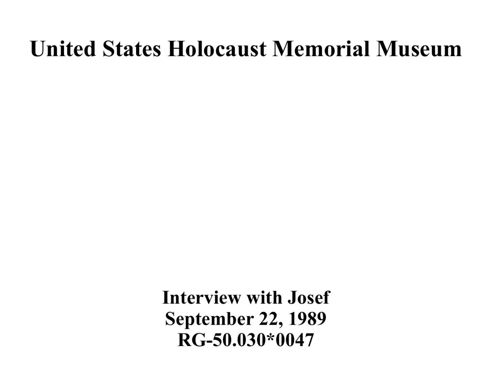
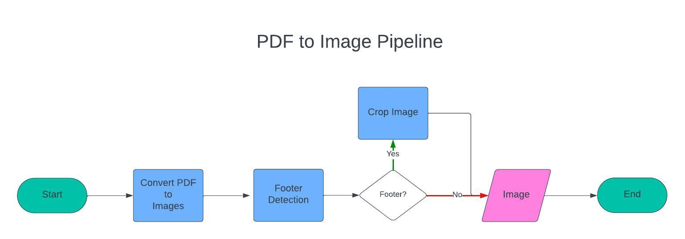
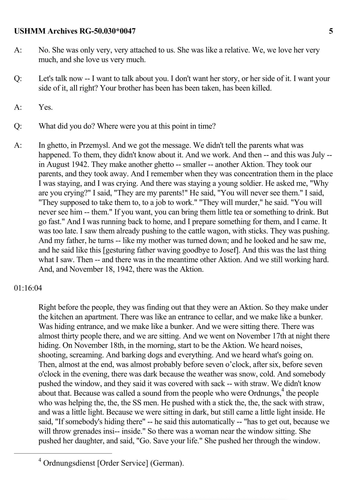
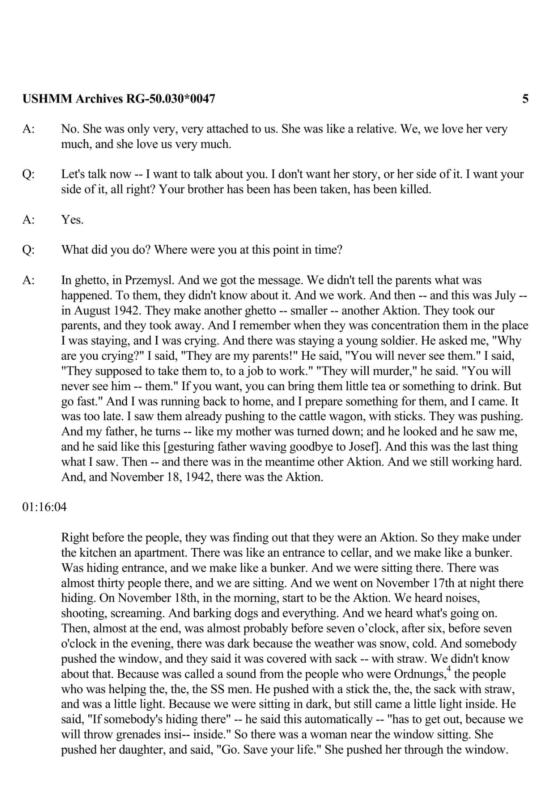
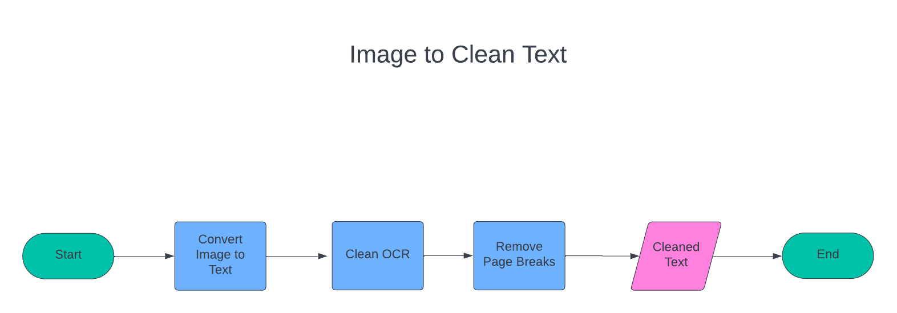

# Introduction

In this blog post, we will be looking at a collection of oral testimonies at the [United States Holocaust Memorial Museum](https://www.ushmm.org/) and a Python library, `ushmm`, we developed for working with these data. These testimonies are available as PDFs at the museum. In this post, we will look at the steps we took to convert these PDFs into raw text and then into structured data. Finally, we will discuss the practices we used to make this dataset available via HuggingFace.


# The Testimonies

The testimonies are available individually as a [Collections Search at the USHMM](https://collections.ushmm.org/search/?f%5Bavailability%5D%5B%5D=digitized&f%5Bavailability%5D%5B%5D=transcript&q=oral+history&search_field=all_fields). For each page of a digitized interview, a user can access a brief summary of the testimony, the keywords and subjects of the testimony (the metadata), and the testimony itself as a PDF (located in the top-right corner of the page). Here is a [sample page](https://collections.ushmm.org/search/catalog/irn504547). Additionally, a user can change the url by adding ".json" to access the [JSON file](https://collections.ushmm.org/search/catalog/irn504547.json) of the transcript. The JSON file contains not only the summary and metadata, but also an OCR'ed transcript. For most tasks, this is enough to query the testimony or make it discoverable based on a keyword search.

The OCR output, however, has several limitations. First, it is only available as a continuous string of text. This means that each page's header, footer, page numbers, etc. are usually inserted in the middle of the text. In other words, what we have is unstructured raw text. We cannot, for example, isolate individual speakers from the testimonies and analyze the data at a speaker-level. With Python, we can overcome this limitation.

Additionally, not all PDFs are formatted the same way. These testimonies were prepared over decades of work at the museum, sometimes in partnership with other institutions, such as Gratz College. There are several formats of these testimonies, therefore. Currently, our Python framework is designed to work with only one of these for post-processing the raw text into structured data. This single cluster represents nearly 25% of the digitized transcripts, numbering over 1,000 testimonies.

The testimonies used in this blog have a front-page that looks like this:



# PDF to Cleaned Images

When working with PDFs, it is often necessary to convert the original PDF into a sequence of images. This is because most Python OCR frameworks require text as inputs. It also allows us to manipulate images individually. The pipeline we developed looks like this:



## Converting a PDF into a sequence of Images

When working with PDFs in an automated fashion, it is helpful to leverage Python for converting a single PDF into a sequence of images. We can then run each image through a pipeline, or a sequence of actions, that we will detail in this blog.


Converting a PDF into a sequence of images can be achieved via `pdf2image` library. The `ushmm-testimonies` library wraps around `pdf2image` to automatically handle this step for you. It also saves each image into a specified directory.


## Identifying Footers with Open-CV

Before we try to convert the image into raw text, we need to do some data manipulation at the image level. Remember, PDF's contain a sequence of images. Through computer vision, we can analyze a single page of a PDF, identify structural elements on the page, and perform some kind of sequential task. In our case, the footer data that we find occasionally at the bottom of the page causes footer data to be inserted mid-sentence to the text that comes before it. In order to identify the footer and remove what comes below it, we can leverage Open-CV in Python which allows us to identify structural elements of a certain height and width.

Footers in most testimonies are separated by a thin horizontal line. We can see an example here at the bottom of the page.





Through Open-CV, we can identify this line and remove anything that comes beneath these texts. For our purposes, we are not interested in preserving the footers because we want to keep the entire testimony as one sequential text. If, however, we wanted to preserve the footers in some way, we could add logic to do so. Once we identify the footers and remove them, we can then save all our images, some of which will be cropped (due to the presence of a footer) and others kept in their original form (due to the absence of a footer).

Again, our Python library handles all these steps for you with the following command:


This allows us to save the cropped images, which now look like this:



# Image to Clean Text

Once we have cleaned images, we can process them via Tesseract to perform OCR and Python to clean the raw text output. This pipeline looks like this:



## OCR

With the footers removed, we can then send our data to an Optical Character Recognition, or OCR, engine. OCR is the process by which we convert an image that contains text into a raw text output. This allows us to not only have a textual representation of the data found on the image of a page, but also query it. OCR does not convert the output into structured, data, however. Instead, it renders the text as a continuous string as it appears on the page. With most OCR engines, line breaks are preserved. This means we do not have sentence structure in our output, rather an image-based representation of the text.

For this project, we could not rely on the OCR output provided by the USHMM's JSON file. Instead, we needed to OCR the PDFs in order to understand when page breaks happened and where header and footer data was located. Understanding these two things allows us to remove superfluous material from the OCR output and understand when sentences may be broken in the output (due to a page break). This single step allows us to reconstruct the testimony as not a single string of text, rather a string of text that accurately represents the data, meaning material that was added to each page (such as headers and footers) is correctly removed.

Because we have thousands of testimonies (in English), we needed a way to automate this process. Fortunately, Python has an API for Tesseract, the Google OCR engine. Currently, this remains one of the best open-source OCR platforms that can be used out-of-the-box with little customization. Also fortunately, our PDFs are fairly clean, meaning they are simple to OCR with relatively few mistakes. With Tesseract we converted all PDFs into a collection of individual images (one for each page), we then passed each image to Tesseract and returned the OCR output.


# Cleaning the OCR Output

At this stage, we have the new OCR from Tesseract for all PDFs, but do not yet have structured data. Here, we have a continuous string of text. Should we wish to perform quantitative analysis or analysis on specific parts of the text, it would prove quite challenging. We cannot, for example, isolate the individual voices of the interviewee from the interviewer.

To convert this into proper structured data where each speaker and their dialogue was represented as a unique piece of data in the testimony, we again leveraged Python.

With a custom Python function, we cleaned each page so that the headers were removed. Next, we used another Python function to merge all pages into a single string of text.

Next, we created another function to check for all instances where a page break or line break occurred mid-sentence; this function merged those sentence into a single line.

A final function then checked to see if any line breaks occurred in the middle of an individual piece of dialogue, we merged those.

When finished, we had a continuous string of text where each section of dialogue was separated by a double line break. At this stage, we could effectively isolate the individual speakers in a given testimony.

To perform these steps, users need to call the `clean_texts` function.

Although the individual voices of the speakers are now separated, we have not marked up the text. Markup allows us to convert this text into an explicit structure defined by tags in markup languages like HTML and XML. For this project, I opted to use HTML.

# Uses for the Data

To convert the data into explicit html structure, we can use the function `process_testimony_texts`. This will parse all our raw text files and convert them into a full html file.


# Making the Data Accessible

# Installation

To work with the `ushmm` library, you pip install it with the following commands:

```
pip install ushmm
```

This library also wraps around Tesseract (for OCR) and Poppler (for parsing PDFs). To work with these, you will need to install each on your system.

## Mac

To use the library on Mac, you should create a new Conda environment and install Tesseract and Poppler via brew. Next you can ensure that Tesseract and Poppler are both in your PATH by installing them via conda-forge.

1. Install Tesseract
```
conda install -c conda-forge tesseract
```

2. Install Poppler
```
conda install -c conda-forge poppler
```


3. Finally you will need to uninstall pdf2image

```
pip uninstall pdf2image
```

4. And reinstall it via conda-forge.

```
conda install -c conda-forge pdf2image
```

Once you have everything installed, you can import the required functions in your Python script or notebook:

```python
from ushmm import pdf_to_images, images_to_text, clean_texts, remove_footers, process_testimony_texts
```

These functions are specifically designed to work on the testimonies at the USHMM.