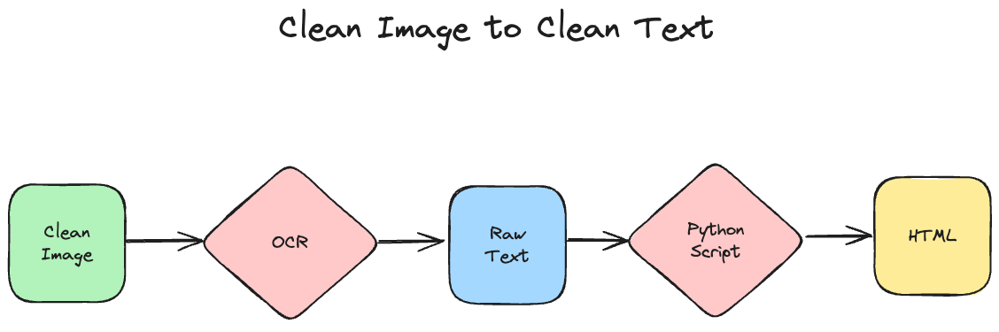

# Introduction

In this blog post, we will be looking at a collection of oral testimonies at the [United States Holocaust Memorial Museum](https://www.ushmm.org/) and a Python library, `ushmm`, we developed for working with these data. These testimonies are available as PDFs from the USHMM's online collection. In this post, we will look at the steps we took to convert these PDFs into raw text and then into structured data. While the material covered in this blog are specific to the USHMM's data, many of the methods and approaches to solve these particular problems are transferable to other data with some modification.


# The Testimonies

The testimonies are available individually as a [Collections Search at the USHMM](https://collections.ushmm.org/search/?f%5Bavailability%5D%5B%5D=digitized&f%5Bavailability%5D%5B%5D=transcript&q=oral+history&search_field=all_fields). For each page of a digitized interview, a user can access a brief summary of the testimony, the keywords and subjects of the testimony (the metadata), and the testimony itself as a PDF (located in the top-right corner of the page). Here is a [sample page](https://collections.ushmm.org/search/catalog/irn504547). Additionally, a user can change the url by adding ".json" to access the [JSON file](https://collections.ushmm.org/search/catalog/irn504547.json) of the transcript. The JSON file contains not only the summary and metadata, but also an OCR'ed transcript. For most tasks, this is enough to query the testimony or make it discoverable based on a keyword search.

The OCR output, however, has several limitations. First, it is only available as a continuous string of text. This means that each page's header, footer, page numbers, etc. are usually inserted in the middle of the text. In other words, what we have is unstructured raw text. We cannot, for example, isolate individual speakers from the testimonies and analyze the data at a speaker-level. With Python, we can overcome this limitation.

Additionally, not all PDFs are formatted the same way. These testimonies were prepared over decades of work at the museum, sometimes in partnership with other institutions, such as Gratz College. There are several formats of these testimonies, therefore. Currently, our Python framework is designed to work with only one of these for post-processing the raw text into structured data. This single cluster represents nearly 25% of the transcripts digitized before 2020.

The testimonies used in this blog have a front-page that looks like this:


# PDF to Cleaned Images

When working with PDFs, it is often necessary to convert the original PDF into a sequence of images. This is because most Python OCR frameworks require text as inputs. It also allows us to manipulate images individually. The pipeline we developed looks like this:


## Converting a PDF into a sequence of Images

The first step in this pipeline requires us to separate the PDF into separate images. We can do this via Python with the library [pdf2image](https://pypi.org/project/pdf2image/). At this stage, we can now work with each individual page of the PDF and clean each page individually.


## Identifying Footers with Open-CV

In the next step, we need to remove footers. The footers often contain explanatory footnotes, but if we were to convert each image into raw text, these footnotes would be injected into the middle of a sentence at the end of a page. This would result in unclean OCR that would be difficult to correct. Here is an example of an image with a footer:


As you can see, the page contains a horizontal line below which sits some footnote material. This is a consistent structural element of every image that contains a footer. This means that we can use this pattern to create a ruler to remove the footer. This can be done via computer vision, or using a computer to view an image and perform some kind of task.

For this project, we opted to use the Python library [Open-CV](https://pypi.org/project/opencv-python/). With Open-CV, we can identify this line and remove anything that comes beneath it. This allows us to save the cropped images, which now look like this:


# Image to Clean Text

Once we have cleaned images, we need to convert them into raw text. To do this, we can again leverage Python and the open-source OCR framework Tesseract. This pipeline looks like this:



## OCR

With the footers removed, we can then send our data to an Optical Character Recognition, or OCR, engine. OCR is the process by which we convert an image that contains text into a raw text output. OCR does not convert the output into structured, data, however. Instead, it renders the text as a continuous string as it appears on the page. With most OCR engines, line breaks are preserved. This means we do not have sentence structure in our output, rather a text-representation of the original image.

Because we have thousands of testimonies (in English), we needed a way to automate this process. Fortunately, Python has PyTesseract, an API for Tesseract, the Google OCR engine. Currently, this remains one of the best open-source OCR platforms that can be used out-of-the-box with little customization. Also fortunately, our PDFs are fairly clean, meaning they are simple to OCR with relatively few mistakes. With Tesseract we converted all PDFs into a collection of individual images (one for each page), we then passed each image to Tesseract and returned the OCR output.


## Cleaning the OCR Output

At this stage, we have the raw OCR from Tesseract for all PDFs, but do not yet have structured data. Should we wish to perform quantitative analysis or analysis on specific parts of the text, it would prove quite challenging. We cannot, for example, isolate the individual voices of the interviewee from the interviewer.

To convert this into proper structured data where each speaker and their dialogue was represented as a unique piece of data in the testimony, we again leveraged Python.

With a custom Python function, we cleaned each page so that the headers were removed. Next, we used another Python function to merge all pages into a single string of text. Another function checks for all instances where a page break or line break occurred mid-sentence and, if found, those cases were merged. A final function then checked to see if any line breaks occurred in the middle of an individual piece of dialogue, we merged those.

When finished, we had a continuous string of text where each section of dialogue was separated by a double line break. This means, we can effectively isolate the individual speakers in a given testimony.

## Convert Text to HTML

Although the individual voices of the speakers are now separated, we have not marked up the text. Markup allows us to convert this text into an explicit structure defined by tags in markup languages like HTML and XML. For this project, we opted for HTML. This allows us to use these files to be easily parsed by humans and machines.

Our HTML schema annotates each individual piece of dialogue and the type of dialogue with a span tag and attribute. There are two types of dialogue: question and answer. These annotations effectively allow us to separate the voices of each speaker in a dialogue.

Another HTML span tag indicates where page breaks occur. This allows us to reconstruct the original PDF should we need to at a later stage. It also means we can easily link the structured HTML file to a specific page in the PDF. This may be useful for displaying the original PDF side-by-side with the text on a website.

Finally, p tags preserve the original paragraphs. This allows for us to easily see when natural breaks occur in speech and it preserves this artifact from the original PDF.

# Installation

We anticipate expanding this project to include a suite of tools to work with other data found in the USHMM collections. For now, however, we are making these functions open-source and available to other scholars. As we apply this approach to other data in the collection, it will be necessary to modify these functions.

To get started with this initial part of the project, you can can install the `ushmm` library, via pip.

```
pip install ushmm
```

This library also wraps around Tesseract (for OCR) and Poppler (for parsing PDFs). To work with these, you will need to install each on your system.

## Mac

To use the library on Mac, you should create a new Conda environment and install Tesseract and Poppler via brew. Next you can ensure that Tesseract and Poppler are both in your PATH by installing them via conda-forge.

1. Install Tesseract
```
conda install -c conda-forge tesseract
```

2. Install Poppler
```
conda install -c conda-forge poppler
```


3. Finally you will need to uninstall pdf2image

```
pip uninstall pdf2image
```

4. And reinstall it via conda-forge.

```
conda install -c conda-forge pdf2image
```

Once you have everything installed, you can import the required functions in your Python script or notebook:

```python
from ushmm import pdf_to_images, images_to_text, clean_texts, remove_footers, process_testimony_texts
```

These functions are specifically designed to work on the testimonies at the USHMM.